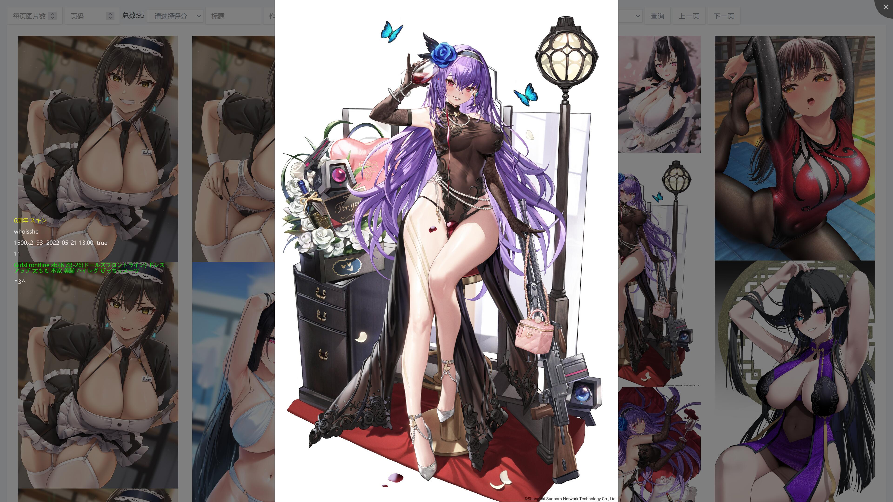
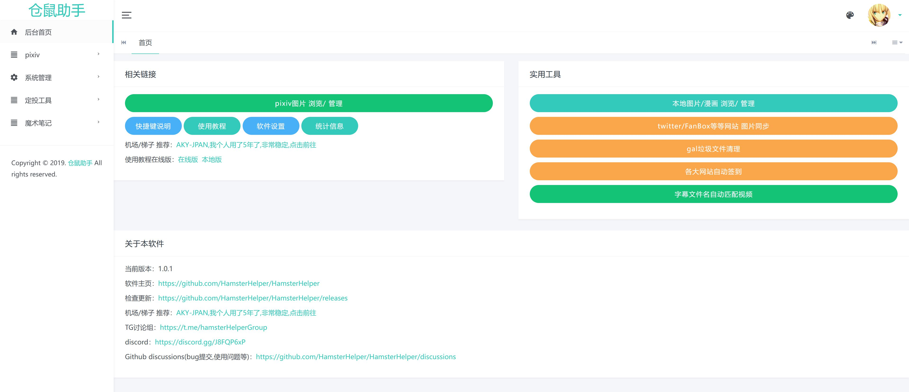

这是我用了5年的东西,共下载了100万色图,筛选出并收藏了13万色图

1.0.0重大更新版本正在测试,近期更新

### 这个项目主要解决哪些问题,有哪些功能?

1. Pixiv图片浏览功能体验太差(加载慢,UI占太多屏幕,图片就占一点屏幕,根本看不清,图片放大之后怼脸上,没有放大指定倍数,旋转,快捷键等等功能)这些问题本软件通通解决,提供沉浸式浏览体验!
2. 解决即使梯子再快,图片也要加载几秒才出来~~加载出来都已经贤者模式了~~,无法痛快浏览问题(图片下载到硬盘,秒加载~~无惧早泄~~)
3. Pixiv广告多烦人,部分功能要VIP
4. 仓鼠收藏图片太多,硬盘不够用(webp压缩功能,约**节约80%硬盘空间**,而肉眼看不出区别)
5. 解决作者退网/被封号,版权问题/忘记打码等等导致**作品删除,珍藏的图片丢失**的问题
6. 看不出图片差分在哪里问题(按一下方向键即可)
7. 只收藏自己喜欢的差分,比如删掉多人,重口差分**只收藏纯爱差分**~~爆杀牛头人~~
8. 仓鼠手动保存图片太麻烦了(自动同步排行榜,收藏的作品,关注的画师作品等等到硬盘)
9. 解决保存之后管理麻烦,想~~施法~~欣赏根本找不到图片在哪问题
10. 保存后,本地图片浏览器体验很差,且无法显示作品标题,作者,标签,描述等信息
11. 图片浏览太耗机场流量,家境贫寒买不起流量(本软件**内置机场,0流量下载色图**)
12. 现有的下载工具都是只管下载不管浏览(用其他浏览器浏览丢失了标签,画师,作品说明等等信息),没有管理,搜索等功能,还要手动下载等等问题,本软件通通解决!

### 功能展示

# [使用教程请点我](https://hamsterhelper.github.io/HamsterHelper/doc/src/SUMMARY.html)

### 交流平台
[Telegram: hamsterHelperGroup](https://t.me/hamsterHelperGroup)

[Github discussions](https://github.com/HamsterHelper/HamsterHelper/discussions)

[discord](https://discord.gg/J8FQP6xP)

### 之后可能会加入的功能(咕咕咕)

1. Twitter/Fanbox/Patreon/Gumroad/exhentai 等图片收藏(部分画师Pixiv不更新或没有Pixiv账号)
2. 动图下载(目前动图下的是静态图)
3. 图片误删撤销功能(ctrl+z键)或回收站功能
4. 漫画浏览器(目前我在用,但是得优化后不会编程的人才能用.个人觉得体验比我用过的所有漫画浏览器都好,加载慢,UI占一大片屏幕,快捷键没有或反人类)
5. 漫画收藏,管理,浏览
6. 番剧,黄油收藏管理
7. ~~根据搜索结果导出图片,用于桌面壁纸,发图片资源贴等~~已完成
8. ~~导出收藏数据用于分享给同样使用该软件的用户,几MB即可分享几万收藏图片,比直接分享图片方便快捷~~已完成
9. 自动备份被作者/Pixiv删除了的图片
10. 收藏后自动点赞,评论,声援作者
11. 下载指定tag所有图片
12. 初始导入已经收藏的全部图片
13. 清理galgame无用文件(部分厂商塞一堆无用文件进去,污染硬盘)
14. galgame注册表恢复(重装电脑导致部分galgame无法运行)
15. 字幕文件自动批量重命名匹配视频文件名
16. 各大网站自动每日签到,领金币等
