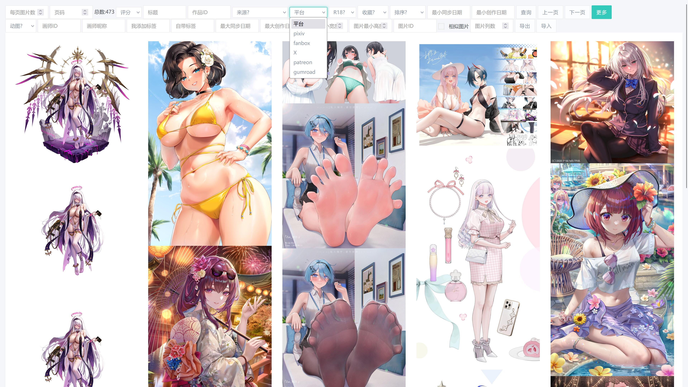

这是我用了两年的东西,没放出来是因为很多代码是为我自己定制的,而且普通用户也没有mysql,jdk等环境,放出来也用不了.现在适配和优化了一下,加了设置等页面,非程序猿也能用了

### 为什么会有这个项目,这个项目主要解决哪些问题,有哪些功能?

1. Pixiv自带的图片浏览功能体验太差了,没有放大,旋转,快捷键等等功能(提供沉浸式浏览体验)
2. 解决即使梯子再快,图片也要加载几秒才出来~~加载出来都已经贤者模式了~~,无法痛快浏览问题(图片下载到硬盘,秒加载~~无惧早泄~~)
3. 仓鼠收藏图片太多,硬盘不够用(webp无损压缩功能,节约大概4/5硬盘空间)
4. 解决作者退网/被封号,版权问题删除作品等导致珍藏的图片丢失的问题
5. 解决星际玩家根本看不出图片差分在哪里问题(按一下方向键即可)
6. 删掉多人,重口差分只收藏纯爱差分~~爆杀牛头人~~
7. 仓鼠手动保存图片太麻烦了(自动同步排行榜,收藏的作品,关注的画师作品等等到硬盘)
8. 解决保存之后管理麻烦,想~~施法~~欣赏根本找不到图片在哪问题
9. 保存后,本地图片浏览器体验很差(提供沉浸式浏览体验)

### 功能展示

### 环境要求
1. ~~理论上~~基本没有要求.非常特殊情况,闪退的话自己安装适配自己设备的jdk(>=1.8)
2. 推荐用火狐,~~理论上~~谷歌内核的浏览器也可以.

### 之后可能会加入的功能(咕咕咕)

1. Twitter图片收藏(部分画师Pixiv不更新或没有Pixiv账号)
2. 动图下载(目前动图下的是静态图)
3. 漫画浏览器(目前我在用,但是得优化后不会编程的人才能用.个人觉得体验比我用过的所有漫画浏览器都好)
4. 漫画收藏,管理,浏览
5. 番剧,黄油收藏管理
6. 根据搜索结果导出图片(用于桌面壁纸,发图片资源贴等)
7. 自动备份被作者/Pixiv删除了的图片
8. 收藏后自动点赞,评论,声援作者
9. 下载指定tag所有图片
10. 初始导入已经收藏的全部图片
